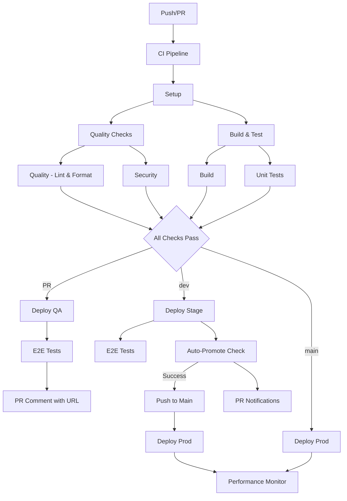

# GitHub Actions Workflow Strategy

## Overview

This repository uses a **modular workflow approach** with separate workflows for different concerns, orchestrated by a main CI pipeline. This provides:

- **Separation of concerns** - Each workflow has a single responsibility
- **Reusability** - Workflows can be called independently
- **Parallel execution** - Independent workflows can run simultaneously
- **Easy maintenance** - Changes to one workflow don't affect others
- **Consistent execution** - All workflows run on every trigger for reliability

## Workflow Granularity

### 1. **Infrastructure & Setup**
- **`setup.yml`** - Shared dependency setup and caching

### 2. **Quality Assurance Workflows**
- **`quality.yml`** - Lint + auto-format in a single job (Biome)
- **`security.yml`** - Security scanning with scheduled and manual runs

### 3. **Build & Test Workflows**
- **`build.yml`** - Build verification across all packages
- **`unit-test.yml`** - Unit tests with coverage reporting
- **`e2e.yml`** - End-to-end tests (Playwright, configurable browsers)
- **`e2e-full.yml`** - Weekly full-browser e2e suite (Chromium + Firefox)

### 4. **Deployment & Monitoring**
- **`deploy.yml`** - Universal deployment workflow (handles all environments)
- **`destroy-feature-environment.yml`** - Automatic cleanup of feature environments
- **`auto-promote.yml`** - Automatic promotion from staging to production
- **`performance.yml`** - Performance monitoring and analysis

### 5. **Orchestration**
- **`ci.yml`** - Main CI pipeline that orchestrates all workflows

## Deployment Environments

### 🧪 **Feature/QA Environments** (PRs)
- **Trigger**: Pull requests to `main` or `dev`
- **URL Pattern**: `https://foundation-qa-{pr-number}.{domain}`
- **Naming**: `qa-{pr-number}` (e.g., `qa-123`)
- **Lifetime**: Short-lived, auto-cleanup on PR close
- **Purpose**: Preview changes before merge

### 🌿 **Staging Environment** (`dev` branch)
- **Trigger**: Push to `dev` branch
- **URL**: `https://foundation-stage.{domain}`
- **Naming**: `stage`
- **Lifetime**: Long-lived, updated on each push
- **Purpose**: Integration testing and QA
- **Auto-Promotion**: ✅ Automatically promotes to production on successful deployment

### 🚀 **Production Environment** (`main` branch)
- **Trigger**: Push to `main` branch (including auto-promotion from `dev`)
- **URL**: `https://foundation-prod.{domain}`
- **Naming**: `prod`
- **Lifetime**: Long-lived, updated on each push
- **Purpose**: Live production application

## Smart Workflow Execution

### **Consistent Execution**
All workflows run on every trigger for maximum reliability and consistency:

- **Quality checks**: Lint, format, and security scans run on all changes
- **Build & test**: Full build verification and test suite execution
- **Deployment**: Appropriate environment deployment based on branch
- **Monitoring**: Performance monitoring on production deployments

### **Shared Setup**
The `setup.yml` workflow handles:
- Dependency caching with smart cache keys
- Node.js and pnpm setup
- Turbo cache configuration

## Auto-Promotion Flow

### 🚀 **Automatic Dev → Main Promotion**

The system includes an **intelligent auto-promotion workflow** that automatically promotes successful staging deployments to production:

#### **How It Works**
1. **Merge to `dev`** → Triggers CI pipeline
2. **Staging Deployment** → Deploys to staging environment  
3. **E2E Testing** → Validates staging deployment
4. **Auto-Promotion Check** → Verifies deployment success
5. **Automatic Push** → Promotes `dev` to `main`
6. **Production Deployment** → Automatically triggered on `main`

#### **Safety Features**
- ✅ **Deployment Verification**: Only promotes if staging deployment succeeds
- ✅ **Intelligent Checks**: Verifies staging job completion via GitHub API
- ✅ **PR Notifications**: Automatically comments on related PRs
- ✅ **Summary Reports**: Provides detailed promotion summaries
- ✅ **Skip Logic**: Won't promote if main is already up-to-date

#### **Benefits**
- **Faster Releases**: Eliminates manual promotion steps
- **Reduced Errors**: Automated process reduces human error
- **Consistent Flow**: Enforces staging → production pathway
- **Transparency**: Full audit trail and notifications

## Workflow Execution Flow

## Benefits of This Approach

### ✅ **Advantages**
1. **Fast Feedback** - Quality checks run immediately and in parallel
2. **Reliability** - All workflows run consistently on every trigger
3. **Easy Debugging** - Clear separation makes issues easier to identify
4. **Flexible Deployment** - Single deployment workflow handles all environments
5. **Cost Control** - Feature environments are short-lived
6. **Smart Caching** - Shared dependency and build caching across workflows
7. **Consistent Execution** - No risk of missing important changes or workflows

### ⚠️ **Considerations**
1. **Complexity** - More files to maintain
2. **Coordination** - Need to ensure workflows work together
3. **Resource Usage** - Multiple parallel workflows can use more resources

## Best Practices

### 1. **Workflow Design**
- Keep workflows focused on a single responsibility
- Use `workflow_call` for reusability
- **Concurrency Strategy**: Only the main CI workflow has concurrency controls
- Called workflows should NOT have their own concurrency groups to avoid deadlocks

### 2. **Environment Management**
- Use environment-specific secrets and database URLs
- Implement proper cleanup procedures
- Monitor resource usage with performance workflow

### 3. **Error Handling**
- Use `if: always()` for cleanup steps
- Implement proper failure notifications
- Add retry logic where appropriate

### 4. **Performance Optimization**
- Shared setup workflow reduces duplication
- Smart caching strategies across all workflows
- Parallel execution of independent workflows

## Adding New Workflows

When adding new workflows:

1. **Identify the concern** - What single responsibility does it have?
2. **Define triggers** - When should it run?
3. **Add to CI pipeline** - How does it fit into the overall flow?
4. **Update documentation** - Keep this README current

## Required Secrets

The following secrets must be configured in your GitHub repository:

| Secret | Description | Used by |
|---|---|---|
| `DATABASE_URL_PROD` | Production Neon connection string | `ci.yml`, `deploy.yml`, `e2e.yml` |
| `DATABASE_URL_STAGE` | Staging Neon connection string | `ci.yml`, `deploy.yml`, `e2e.yml` |
| `AUTH_SECRET` | Better Auth signing secret | `deploy.yml` |
| `CLOUDFLARE_API_TOKEN` | Cloudflare API token (Workers + Hyperdrive) | `deploy.yml`, `create-feature-db.yml`, `destroy-feature-environment.yml` |
| `NEON_API_KEY` | Neon API key for branch management | `create-feature-db.yml`, `destroy-feature-environment.yml` |
| `GOOGLE_CLIENT_ID` | Google OAuth client ID | `deploy.yml` |
| `GOOGLE_CLIENT_SECRET` | Google OAuth client secret | `deploy.yml` |

Optional:

| Secret | Description | Used by |
|---|---|---|
| `PAT_TOKEN` | GitHub PAT for cross-workflow triggers (falls back to `GITHUB_TOKEN`) | `auto-promote.yml` |
| `ANTHROPIC_API_KEY` | Anthropic API key for automated code reviews | `auto-review.yml` |

## Required Repository Variables

| Variable | Example | Used by |
|---|---|---|
| `HYPERDRIVE_ID_PROD` | `abc123...` | `deploy.yml` |
| `HYPERDRIVE_ID_STAGE` | `def456...` | `deploy.yml` |
| `NEON_PROJECT_ID` | `spring-rain-123456` | `create-feature-db.yml`, `destroy-feature-environment.yml` |
| `NEON_DATABASE_NAME` | `neondb` | `create-feature-db.yml` |
| `NEON_ROLE_NAME` | `neondb_owner` | `create-feature-db.yml` |
| `CLOUDFLARE_ACCOUNT_ID` | `a92d163...` | `deploy.yml`, `create-feature-db.yml`, `destroy-feature-environment.yml` |
| `CLOUDFLARE_APP_DOMAIN` | `solutionstack.dev` | `deploy.yml` |
| `WORKERS_DEV_SUBDOMAIN` | `mason-smith.workers.dev` | `deploy.yml` |
| `ALLOWED_ORIGINS_STAGE` | `https://foundation-stage.solutionstack.dev` | `deploy.yml` |
| `ALLOWED_ORIGINS_PROD` | `https://foundation.solutionstack.dev` | `deploy.yml` |

`ALLOWED_ORIGINS` is computed automatically in CI as:
- Feature environments: `https://foundation-{branch-name}.{WORKERS_DEV_SUBDOMAIN}`
- Staging: `ALLOWED_ORIGINS_STAGE`
- Production: `ALLOWED_ORIGINS_PROD`

## Environment-Specific Database URLs

The workflows automatically select the appropriate database URL:
- **Pull Requests**: `generated by neon`
- **Dev branch**: `DATABASE_URL_STAGE`  
- **Main branch**: `DATABASE_URL_PROD`

## Troubleshooting

### Common Issues
- **Workflow not running**: Check trigger conditions and branch filters
- **Deployment failures**: Verify environment secrets and permissions
- **Feature environment not created**: Check PR number and concurrency groups
- **Deadlock detected**: Remove concurrency groups from called workflows
- **Database connection errors**: Verify environment-specific `DATABASE_URL` secrets

### Debugging Steps
1. Check workflow logs in GitHub Actions
2. Verify environment variables and secrets
3. Test workflows locally when possible
4. Review concurrency group settings 
